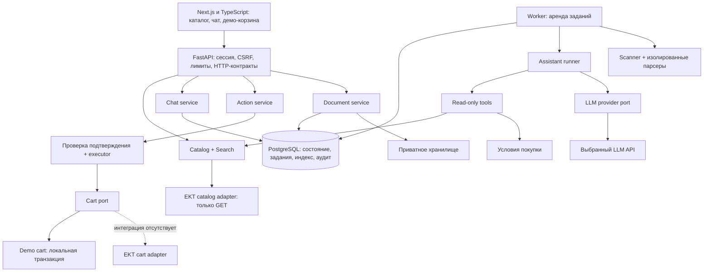

# Архитектура MVP: каталог и ИИ-консультант ekt.kz

Статус: целевая архитектура и поэтапная реализация MVP. Уже есть HTTP API сессий и диалогов, durable локальная очередь/worker, доменная логика каталога и ассистента. Текущий состав, режимы и ограничения фиксируются в [backend-integration.md](backend-integration.md); описанные ниже production-механизмы не считаются реализованными автоматически. Контракт внешнего API: [api.md](api.md). Порядок реализации: [mvp-plan.md](mvp-plan.md).

## 1. Решения и границы MVP

**Модульный монолит:** Python/FastAPI для API, Next.js + TypeScript (App Router) для интерфейса, целевая PostgreSQL для состояния и поискового индекса. Один backend-код запускается в двух процессах: HTTP API и worker. Сейчас до объединения основной БД используется сменный SQLite StateStore для локального режима. В целевой системе PostgreSQL обслуживает также устойчивую очередь задач. Файлы должны обрабатываться worker в изолированном дочернем процессе с пределами ресурсов; эта интеграция ещё не включена. Для локального демо — приватный volume; интерфейс хранилища позволяет позже подключить S3-совместимый сервис.

Этот стек выбран как рабочая основа проекта, не как требование исходного ТЗ. Версии и зависимости фиксируются lock-файлами при реализации. На первом этапе не требуются Kubernetes, отдельный брокер, векторная БД или шесть автономных агентов. Масштабирование начинается с индексов, ограничений нагрузки и реплик процессов, а не с разделения кода на сетевые сервисы.

| Область | Решение на 5 часов | Продолжение после MVP |
| --- | --- | --- |
| Данные | Реальный read-only API каталога, проверенная выборка/индекс с явным покрытием | Полная инкрементальная синхронизация после уточнения API |
| Корзина | Собственная демонстрационная корзина и честная маркировка | Адаптер корзины ekt.kz после получения контракта |
| ИИ | Одна роль консультанта, закрытый набор read-инструментов, сменный provider | Дополнительные роли и провайдеры без изменения доменных сервисов |
| Поиск | Точный артикул/ID, текст, фильтры категории, проверенные пары аналогов | Триграммные индексы, атрибутные правила, затем embeddings при доказанной пользе |
| Документы | Ограниченный PDF с текстом, DOCX, XLSX, JPEG/PNG через подключённый OCR/vision | Старые форматы, большие спецификации и дополнительные парсеры |
| Надёжность | Сохранённые задачи, идемпотентность, таймауты, восстановление worker | Несколько API/worker, общий storage, HA PostgreSQL |
| Встраивание | Тот же origin через reverse proxy, отдельный frontend-модуль чата | JS SDK/iframe после согласования origin и сессий |

Скан без OCR/vision не считается прочитанным. Неизвестный формат не считается поддержанным. Отсутствие антивирусного вердикта не разрешает парсинг публичной загрузки. Если эти зависимости не готовы, соответствующая возможность возвращает `requires_integration`, а демо работает с заранее проверенными файлами. Это частичное выполнение входных форматов ТЗ, которое требуется явно показать на приёмке.

MVP устойчив к отдельным ошибкам зависимостей и перезапуску процесса при сохранной БД. Один сервер и одна БД остаются точками отказа: высокая доступность площадки не заявляется до репликации, резервных копий и проверки восстановления.

## 2. Схема и направление зависимостей



Порядок импортов: `api → application services → domain contracts/ports`. Адаптеры реализуют порты; `bootstrap.py` связывает конкретные реализации. Доменные контракты не импортируют FastAPI, SDK модели, HTTP-клиент или UI. Сервисы не импортируют друг друга циклически; координация нескольких доменов находится в application-service.

Поиск доступен без LLM. `assistant` не импортирует executor корзины и не получает CartPort, mutable ORM-session, файловую систему или универсальный HTTP-клиент. Модель не выбирает адрес API, SQL, команду shell, prompt-файл или имя Python-функции.

## 3. Целевая структура файлов

Дерево — план реализации. Здесь перечислены конкретные владельцы ответственности; пустые пакеты ради дерева не создаём. `routes.py` отвечает только за транспорт, `service.py` — за сценарий, `schemas.py` — за внешний DTO, `repository.py` — за запросы к БД. Выносим файл при появлении отдельной ответственности, не делим одну короткую функцию искусственно.

```text
backend/
  pyproject.toml                  # зависимости и настройки проверок
  app/
    main.py                       # HTTP-приложение, middleware, lifespan
    bootstrap.py                  # создание клиентов и связывание портов
    worker.py                     # запуск обработчиков durable jobs
    core/
      config.py                   # загрузка и валидация конфигурации
      errors.py                   # доменные ошибки и безопасные коды
      security.py                 # session ownership, CSRF, Origin
      limits.py                   # входные пределы и общие квоты
      observability.py            # request_id, метрики, редактирование логов
    api/v1/
      router.py                   # сборка routes
      dependencies.py             # текущая сессия, зависимости сервисов
      health.py                   # liveness / readiness / capabilities
    modules/
      catalog/
        models.py                 # Product, Attribute, StockSnapshot
        ports.py                  # CatalogSource
        service.py                # get_product(), get_current_stock()
        normalization.py          # category_from_url(), extract_attributes()
        quality.py                # detect_conflicts(), sellable_stock()
        repository.py             # индекс и версии снапшотов
        sync.py                   # sync_page(), checkpoint, publish_snapshot()
        routes.py
        schemas.py
      search/
        models.py                 # SearchQuery, SearchMatch, MatchKind
        service.py                # search(), batch_search()
        repository.py             # предикаты, сортировка, пагинация
        identifiers.py            # исходный код и поисковые ключи
        alternatives.py           # verified links + deterministic constraints
        routes.py
        schemas.py
      knowledge/
        service.py                # answer_policy_question() по утверждённым данным
        repository.py             # версионные условия оплаты/доставки
      chat/
        models.py                 # Conversation, Turn, Message
      service.py                # доменный ChatService из логики ассистента
      application.py            # submit_turn(), atomic очередь и HTTP orchestration
        repository.py             # транзакция message + run + job
        routes.py
        schemas.py
      assistant/
        runner.py                 # bounded цикл model/read-tool
        registry.py               # роли, capabilities, инструменты, статусы
        context.py                # ограниченная история и очищенные источники
        contracts.py              # AssistantOutput, Claim, SuggestedAction
        policy.py                 # полномочия, allowlist, unknown/conflict
        provenance.py             # source refs, проверка claim-path
        rendering.py              # ответ из проверенных фактов
        budget.py                 # reserve(), settle(), quarantine()
        tools.py                  # типизированные фасады read-сервисов
        ports.py                  # LlmProvider; vendor-neutral сообщения
        prompts/
          consultant.md           # поведение консультанта
          data_policy.md          # документы/каталог как недоверенные данные
      documents/
        service.py                # upload(), status(), ownership
        validation.py             # MIME, байты, архивы, лимиты
        ports.py                  # BlobStore, MalwareScanner, ImageReader
        extraction.py             # выбор парсера и результат на каждый файл
        parsers/
          pdf.py
          docx.py
          xlsx.py
          image.py
        routes.py
        schemas.py
      actions/
        models.py                 # Proposal, Approval, Receipt
        service.py                # propose(), confirm(), reject()
        executor.py               # revalidate() → apply() → receipt
        repository.py             # idempotency, CAS, transaction
        routes.py
        schemas.py
      cart/
        models.py                 # Cart, CartLine, CartVersion
        ports.py                  # CartPort
        service.py                # get_cart(); mutation вызывается executor
        routes.py
        schemas.py
    adapters/
      ekt/catalog.py              # Basic Auth, GET, таймауты, JSON validation
      ekt/mapping.py              # внешний JSON → доменная модель
      ekt/cart.py                 # requires_integration до реального API
      cart/demo.py                # транзакционная демо-корзина
      llm/provider.py             # единственное место SDK выбранного вендора
      llm/disabled.py             # отсутствие LLM без сетевых вызовов
      storage/local.py            # приватный volume для демо
      scanner/clamav.py           # обязательный вердикт для публичных файлов
    infrastructure/
      db.py                       # connection pools, transaction scope
      jobs.py                     # DB queue: lease, fencing, recovery
      audit.py                    # append-only события без содержимого файлов
  migrations/                     # версии схемы БД
  tests/
    unit/                         # нормализация, конфликты, политика, состояния
    integration/                  # БД, сессии, очередь, idempotency
    contract/                     # обезличенные EKT fixtures, provider DTO
frontend/
  package.json
  src/
    app/                          # маршруты, providers, error boundary
    features/
      catalog/                    # выдача и карточка
      assistant/                  # чат, состояния, подсказки, файлы
      cart/                       # демо-корзина и квитанции
      confirmations/              # показ конкретного proposal и подтверждение
    shared/
      api/                        # typed client + единая обработка ошибок
      ui/                         # общие компоненты
      config/                     # только публичные настройки
  tests/                          # ключевой браузерный сценарий
data/curated/                     # проверенные демо-пары и условия с provenance
infra/                           # compose, reverse proxy, инструкции восстановления
docs/
  architecture.md
  api.md
  mvp-plan.md
.env.example
.gitignore
```

## 4. Контракты между модулями

У интерфейсов нет зависимости от модели поставщика. DTO проходят валидацию на входе и выходе; закрытые пользовательские/LLM-схемы запрещают неизвестные поля. Внешние EKT-схемы допускают новые дополнительные поля, но не подменяют отсутствующие обязательные данные значениями по умолчанию.

| Порт / операция | Вход | Выход и ограничения |
| --- | --- | --- |
| `CatalogSource.list_page(page)` | Положительный номер страницы | Page со сведениями о покрытии; только GET |
| `CatalogSource.get_detail(id)` | Внутренний ID | SourceProduct с fetched_at, сырыми полями и конфликтами |
| `SearchService.search(query)` | Строка, разрешённые фильтры, limit | Matches, match_kind, warnings, coverage; без LLM |
| `AlternativeService.find(product_id)` | Товар + требования | Проверенные связи/кандидаты, совпадения и расхождения |
| `LlmProvider.generate(request)` | Контекст, allowed read tools, output schema, budget | Typed final output либо один read-tool request; расход и outcome |
| `DocumentExtractor.extract(asset_id)` | Уже проверенный и разрешённый файл | Фрагменты с source refs, статусы страниц/листов, ограничения |
| `ActionService.propose(session, items)` | Предложенные ID и количества | Серверный proposal с ценами, версией, TTL и hash |
| `ActionService.confirm(session, id, version)` | Подтверждение конкретного proposal | Сохранённое approval + durable execution job |
| `CartPort.apply(command, operation_id)` | Проверенная серверная команда | Applied receipt / rejected / outcome_unknown; без LLM |

Пример нормализованного товара: `id`, `article_original`, `supplier_article`, `name`, `category_path`, `price.amount`, `price.currency`, `attributes[]`, `stock.status`, `stock.reported_quantity`, `stock.sellable_quantity`, `source_refs[]`, `fetched_at`, `source_updated_at`, `warnings[]`. Неизвестная валюта/продаваемый остаток остаются null. Конфликтный критичный атрибут не получает финального value до разрешения.

`SearchMatch.match_kind`: `exact_original`, `normalized_candidate`, `verified_alternative`, `possible_match`, `description_match`. Удаление разделителей или подмена похожих букв даёт кандидата, а не доказанную идентичность. Исходный артикул сохраняется. Внешний score не выдаётся за вероятность совместимости.

`AssistantOutput`: `message`, `product_ids[]`, `claims[]`, `source_refs[]`, `unknowns[]`, `suggested_action|null`. Модель предлагает только ID/количество; цены, остатки, URL и итог операции берутся сервером из разрешённых источников. Для суммы используются Decimal и серверный расчёт. Критичные факты карточек и операций отображаются детерминированно. Если произвольный текст модели противоречит проверенным фактам, ответ не публикуется: используется безопасная формулировка из этих фактов с сообщением об ограничении.

## 5. Данные и транзакции

| Таблица / группа | Основной смысл и ключ |
| --- | --- |
| sessions | Hash случайного session token, expiry, revoked_at; серверный владелец ресурсов |
| conversations, messages | session_id, порядковые номера, ограниченный срок хранения |
| turns, runs | `(session_id, idempotency_key)` unique + canonical payload hash; статус, config/prompt version |
| jobs | kind, resource_id, state, lease_until, fencing_token, attempts, next_attempt_at |
| run_steps, tool_calls | Последовательность, outcome, безопасные argument/result hashes; provenance snapshot приватно и с TTL |
| products, product_attributes | Сырой оригинал отдельно от нормализованных полей; конфликты и source refs |
| stock_snapshots, sync_runs | Время получения, coverage, checkpoint, статус импорта |
| verified_alternatives | Пара товаров, ограничения, источник подтверждения, версия |
| policy_documents | Утверждённый текст, версия, источник; demo/real метка |
| assets, extraction_fragments | session_id, generated storage key, scan status, parser version, source location |
| proposals, approvals | Владелец, payload hash, expected cart version, evidence snapshot, expiry, decision |
| carts, cart_lines | demo cart с версией; `(cart_id, product_id)` unique |
| receipts | UNIQUE operation_id, исход операции, версия корзины, публичная ссылка |
| usage_reservations, usage_ledger | Резерв токенов, лимиты session/site, фактический расход либо неизвестность |
| audit_events | append-only события действий без секретов и полного содержимого диалогов |

Сообщение, turn, run и job создаются одной транзакцией. Повтор с тем же ключом и полным каноническим телом (включая порядок вложений, язык, контекст страницы) возвращает прежний turn. Иное тело с тем же ключом даёт 409. Проверка и unique constraint находятся в БД; process-local lock недостаточен. Диалог имеет не более одного активного turn; второй независимый запрос получает `conversation_busy`.

Worker забирает job с блокировкой строки, записывает lease/fencing_token и коммитит до сети. Переходы состояний разрешены только владельцу актуального fencing_token. Истёкшая аренда позволяет перепроверить job и продолжить безопасный этап. Если платный вызов уже был отправлен, новый worker не повторяет его автоматически: исход отмечается неизвестным, резерв сохраняется до сверки/консервативного закрытия.

Доставка задач — at-least-once. Однократный эффект локальной корзины достигается уникальным operation_id и транзакцией корзина+квитанция. «Exactly once» всей распределённой системы не обещается.

## 6. Жизненный цикл ИИ-запроса

1. API проверяет сессию, ownership каждого asset, CSRF, лимиты, доступность capability.
2. `chat.service.submit_turn` атомарно создаёт turn/run/job. Возвращает 202 и ссылки состояния.
3. Worker выбирает маршрут. Точный артикул/ID сначала обрабатывается поиском без LLM. Цена/наличие могут отвечаться полностью шаблоном. Для объяснения — максимум один вызов без инструментов, если данных достаточно.
4. Для свободного запроса runner собирает ограниченный контекст, применяет редактирование персональных данных и прикладывает происхождение каждого факта. Данные истории, API и файлов помечены как недоверенные.
5. Перед каждым обращением проверяются отмена, актуальная сессия/права, capability и общий лимит. В транзакции резервируется максимальный разрешённый расход следующего шага.
6. Provider получает только разрешённые инструменты. Один вызов инструмента на шаг; неизвестное имя, лишние аргументы, несколько вызовов или превышение лимита отвергаются. Никакого eval/динамического импорта.
7. Read-tools получают только фасады чтения. Локальные SQL-чтения используют read-only транзакцию/роль; EKT-клиент поддерживает только фиксированные GET. Audit и бюджет пишет runner своей отдельной транзакцией, не инструмент. SELECT-функции с побочными эффектами не доступны роли чтения.
8. Расход сохраняется до разбора вывода. Проверяются закрытая схема, допустимость предложенного действия, ID товаров и источники фактов. Неверифицированные критичные факты удаляются вместе с зависимым предложением; ответ сообщает неизвестность.
9. Сервер строит карточки и при необходимости proposal. Создание proposal не меняет корзину.
10. Состояние коммитится; UI получает результат через polling. SSE можно добавить как проекцию тех же записей, без отдельного источника истины и без сырых токенов модели до валидации.

Capabilities: `product_lookup`, `availability`, `alternatives`, `purchase_terms`, `attachment_extract`, `cart_proposal`. Статусы `ready`, `pilot`, `requires_integration`, `disabled` валидируются при запуске. До появления рабочего провайдера `LLM_ENABLED=false`; ключ сам по себе не включает расход. Чтение каталога и поиск продолжают работать.

## 7. Подтверждение и исполнение корзины

```text
PROPOSED → CONFIRMED → QUEUED → EXECUTING → APPLIED
    ├→ REJECTED       │             ├→ STALE (нужен новый proposal)
    └→ EXPIRED        │             ├→ FAILED (доказанный отказ)
                     └─────────────└→ OUTCOME_UNKNOWN (внешний исход неизвестен)
```

Proposal фиксирует владельца, конкретные товары/варианты и количества, displayed prices, текущий cart version, снапшот данных и policy version, payload hash, TTL. Клиент не задаёт цену и чужой cart ID. В предложение нельзя подмешивать непроверенные URL или данные модели.

Подтверждение — отдельная защищённая HTTP-команда с proposal_id и version. Основной UI — явная кнопка с составом и количеством. Для текстового «да, добавь» сервер разрешает ограниченный точный набор фраз только при одном текущем предложении, проверяет его версию/срок и показывает подтверждённый состав. Неоднозначный ответ приводит к уточнению; LLM не создаёт approval.

Перед применением повторяются ownership, feature flag, TTL, hash, текущие цена/наличие, ограничения количества, cart version и отсутствие квитанции. Изменение существенных данных требует нового предложения. Для MVP количество — положительное целое для товаров с подтверждённой единицей «шт»; дробные единицы и неизвестная кратность требуют уточнения, не округления.

DemoCartAdapter обновляет строки, версию корзины и receipt одной транзакцией. Проверяет суммарное количество с уже лежащими в корзине товарами. Конкурирующие подтверждения сериализуются блокировкой корзины. Демо не резервирует реальный склад и не гарантирует доступность при последующем заказе в ekt.kz.

Для будущего EktCartAdapter нужны внешний idempotency key и чтение результата/версии. Локальный savepoint **не откатывает HTTP-запись на чужом сервере**. При таймауте после отправки нельзя слепо повторять добавление: `OUTCOME_UNKNOWN`, сверка через API, затем квитанция или ручное разрешение. При отсутствии механизма сверки реальная интеграция остаётся выключенной. Строгая гарантия остатков при одновременных продажах требует атомарной проверки/резерва у владельца склада.

## 8. Собственный HTTP API (проект v1)

Endpoint-ы ниже ещё не реализованы и не относятся к `/api/products` партнёра.

| Метод и путь | Назначение |
| --- | --- |
| POST `/api/v1/session` | Создать/возобновить анонимную сессию; HttpOnly cookie + CSRF token |
| GET `/api/v1/capabilities` | Реальная доступность функций и demo/real modes |
| GET `/api/v1/products?query=...` | Поиск индекса; coverage/warnings обязательны |
| GET `/api/v1/products/{id}` | Нормализованная карточка с provenance/quality |
| GET `/api/v1/products/{id}/alternatives` | Серверный подбор с объяснимыми критериями |
| POST `/api/v1/conversations` | Создать разговор текущей сессии |
| POST `/api/v1/conversations/{id}/turns` | Idempotency-Key; message, asset_ids, language, page_product_id; 202 |
| GET `/api/v1/turns/{id}` | Состояние и проверенный финальный ответ владельцу |
| POST `/api/v1/turns/{id}/cancel` | Отмена до следующей контрольной точки; уже отправленный запрос может стоить денег |
| POST `/api/v1/assets` | Ограниченный multipart upload → 202 quarantine |
| GET `/api/v1/assets/{id}` | Scan/extraction status, без чужих файлов |
| POST `/api/v1/cart/proposals` | Явно подготовить предложение из разрешённых ID/количеств |
| POST `/api/v1/proposals/{id}/confirm` | version + Idempotency-Key → approval/job; 202 |
| POST `/api/v1/proposals/{id}/reject` | Отклонение без мутации корзины |
| GET `/api/v1/proposals/{id}` | Статус и receipt после исполнения |
| GET `/api/v1/cart` | Корзина текущей сессии, mode и version |
| GET `/health/live`, GET `/health/ready` | Процесс жив; БД и миграции готовы. Отказ LLM — degraded capability, не crash |

Успех: `{data, meta: {request_id, warnings}}`. Ошибка: `{error: {code, message, retryable}, meta: {request_id}}`. Не отдаём exception, stack trace, upstream body, секреты, системный prompt. 401 — нет действующей сессии; чужой ресурс — 404; 409 — конфликт версии/идемпотентности; 413 — размер; 415 — формат; 422 — ввод; 429 — квота; 503 — недоступная зависимость. Семантика отсутствия товара отделена от недоступности API.

## 9. Безопасность клиентов и владельца

| Риск | Механизм принуждения |
| --- | --- |
| Чужой разговор/корзина/файл | Ownership в каждом запросе, scope в SQL до LIMIT, случайные ID не заменяют проверку |
| Подделка подтверждения | HttpOnly/Secure/SameSite cookie, CSRF token и Origin allowlist для всех мутаций, серверный proposal |
| Внедрение инструкций | Закрытые tools, строгие схемы, нет write-capabilities у модели; недоверенный контент не становится system prompt |
| Выдуманная цена/аналог | Серверные price/stock DTO, source refs, конфликтный статус, таблица проверенных аналогов |
| Утечка ключей | Backend secrets, .env исключён из Git, маскирование заголовков, секреты не входят в context/DTO |
| SSRF / произвольная сеть | EKT host/path allowlist, нет fetch URL из LLM, запрет редиректов с credentials; файлы только asset_id |
| XSS | Экранированный текст, ограниченный Markdown без raw HTML; HTTPS allowlist ссылок и CSP |
| Опасный файл | MIME+signature, размер потока, quarantine, scanner clean, пределы ZIP/XML/пикселей, sandbox без сети |
| Утечка персональных данных | Минимизация, редактирование текста до provider, приватный storage, TTL; изображения требуют отдельного согласованного режима обработки |
| Неконтролируемый расход | Бюджет до каждого вызова, max steps/tokens, session+IP+site quotas, provider kill switch |
| Подмена клиентского контекста | Клиент передаёт только page_product_id; сервер заново читает факты и проверяет доступ |

Не доверяем произвольному X-Forwarded-For: IP берётся только из настроенного доверенного reverse proxy. CORS — конкретный origin, без wildcard с credentials. SameSite по умолчанию Lax, HTTPS Secure обязательно в публичном окружении. Для same-origin встраивания подходят CSP frame-ancestors self и X-Frame-Options SAMEORIGIN. Cross-origin iframe потребует отдельного решения CSP/cookies; автоматически ослаблять эти настройки нельзя.

Политика хранения для демо: сессия 24 часа неактивности, исходные файлы и извлечённый текст не более 24 часов, диалоги 7 дней, обезличенный аудит 30 дней. Значения — предлагаемые стартовые ограничения, уточняемые с владельцем. Cleanup удаляет также связанные приватные provenance snapshots; секреты/полные prompts/файлы не попадают в логи. При переходе в production политика распространяется и на резервные копии.

Регулярные выражения не гарантируют удаления всех персональных данных. До подключения провайдера согласуются допустимые категории данных и его политика хранения; параметр SDK, отключающий сохранение ответа, не доказывает нулевое хранение у вендора. Платёжные данные не запрашиваются и не обрабатываются.

## 10. Отказы, лимиты и расходы

| Отказ | Поведение |
| --- | --- |
| LLM выключен/недоступен | Поиск и карточки доступны; чат сообщает ограничение и показывает проверенные результаты |
| EKT недоступен | Старые описания можно показать со временем получения; наличие неизвестно, зависимое добавление блокируется |
| БД недоступна | 503; не запускаем платные вызовы и операции без durable записи |
| Worker остановился | Задания остаются в БД, восстановление по lease; неизвестный платный/внешний исход не повторяется вслепую |
| Parser завис/упал | Дочерний процесс завершается по timeout; файл получает failed, остальные файлы сохраняют результаты |
| Scanner недоступен | Файл остаётся quarantine; контент не отправляется модели |
| Истёк proposal/изменились данные | STALE/EXPIRED и новое предложение вместо скрытого изменения заказа |
| Перегрузка | Ограниченная очередь, 429/503 с Retry-After, без бесконечного накопления |

Начальные пределы, которые предстоит измерить: текст 8 КБ; 3 файла по 10 МБ; 20 страниц PDF; 200 строк таблицы; 4 изображения и предел декодированных пикселей; 20 сообщений/32 КБ истории; 20 поисковых кандидатов; 32 КБ результата tool; 3 вызова LLM и 2 tool calls на turn; 1500 output tokens на вызов. Превышения дают явный статус и число необработанных страниц/строк. Нельзя выдавать частичный разбор за полный.

Интерактивный EKT deadline 5 с; LLM attempt 12 с и turn deadline 25 с; extraction job 30 с; lease 60 с с heartbeat. В MVP обычный запрос к известному товару целится в p95 ≤ 5 с, UI подтверждает принятие ≤ 1 с. Эти цифры — цели, не замеры; тяжёлые файлы асинхронны. Для зависимостей вводятся ограничение конкурентности и circuit breaker; результат открытого breaker — unavailable, не отсутствие товара.

Перед LLM резервируем верхнюю оценку входа + max output в общей БД по session/site. Даже без денежного тарифа токенный потолок действует. Ненулевые лимиты и allowed model обязательны для включения provider. Для денежного потолка требуется версионированная тарифная конфигурация. Важен порядок: reserve/commit → network → record usage → interpret. Неизвестный расход не освобождается как будто запрос не состоялся.

У LLM SDK автоматические повторы отключены до доказанной идемпотентности провайдера. Классификация ошибок определяется его контрактом, а не универсальным предположением «любой 4xx бесплатный». Для EKT GET допустим один ограниченный повтор. Внешние записи не повторяются без безопасного operation_id и возможности сверки.

Метрики: latency p50/p95, upstream timeouts, queue age, stale jobs, rate limits, token reservations/usage, conflict count, missing evidence, proposal→applied, неизвестные исходы. Audit хранит actor/approver/channel отдельно; пользователю показываем понятную фазу без внутренних данных модели.

## 11. Подключение ключей и будущих интеграций

Сейчас `.env.example` содержит только три пустых секрета. При реализации `core/config.py` читает env один раз через typed settings; `bootstrap.py` выбирает адаптеры. Стартовые значения в коде: `LLM_ENABLED=false`, `CART_MODE=demo`, загрузки выключены до подключения scanner. Само наличие LLM_API_KEY не включает provider.

Для активации LLM добавляются и документируются `LLM_PROVIDER`, `LLM_MODEL`, `LLM_ENABLED`, ненулевые бюджеты, разрешённые модели и политика данных. Базовый URL провайдера задаёт оператор, не пользователь/модель. Неизвестный provider, включённый provider без ключа, нулевые лимиты или real cart без адаптера — ошибка конфигурации на старте. В режиме disabled пустой ключ корректен и гарантирует отсутствие платных вызовов.

`LLM_API_KEY`, `EKT_API_USER`, `EKT_API_PASSWORD` доступны только серверу. Никаких VITE_/NEXT_PUBLIC_ для секретов. `.env` не возвращается через web root и не копируется в образ; секреты передаются при запуске. Перед первым push проверяется staging area: .gitignore не удаляет ранее закоммиченный секрет.

Новый provider = реализация LlmProvider + contract tests + регистрация в bootstrap. Новая корзина = CartPort + контракт идемпотентности/ownership/сверки + интеграционные тесты. Новый источник каталога = CatalogSource и mapper. Изменение этих интеграций не требует менять UI или промпт консультанта.

## 12. Путь масштабирования

1. Несколько API-процессов без локального состояния; общие сессии, квоты и очередь в PostgreSQL. Ограничить общий connection pool и квоты внешних API.
2. Добавить worker по длине очереди, сохраняя аренды и уникальность операций; разграничить file и chat jobs, чтобы PDF не вытесняли короткие ответы.
3. Перенести BlobStore в общее приватное хранилище. Локальный volume допустим только пока процессы используют один хост/общий mount.
4. Расширять полнотекстовые/триграммные индексы после измерения recall и latency; фильтрация перед LIMIT, стабильная сортировка, видимость данных внутри SQL.
5. При доказанном узком месте выделять document processing или assistant execution в отдельный сервис через существующие порты. Контракты версионировать.
6. Для публичной эксплуатации: резервное копирование и restore drill, TLS, мониторинг, обновления зависимостей, репликация БД и проверка tenant isolation до подключения второго владельца каталога.

MVP обслуживает один магазин. Поддержка нескольких независимых владельцев требует `tenant_id` из доверенного server context во всех ключах, SQL, jobs, storage и квотах плюс тесты изоляции. Пользовательский tenant_id не принимается. Простое добавление столбца не считается реализованной multi-tenancy.

## 13. Что изменено относительно референса

Источник: предоставленный пользователем `D:/Jetsonic-marketplace/docs/CATALOG_AI_ASSISTANT_REFERENCE_ARCHITECTURE.md`. Это материал для анализа; его утверждение об эксплуатации не проверялось независимо. Из него приняты разделение поиска и ИИ, серверные полномочия, provenance, durable jobs, подтверждения, бюджеты и явные ограничения.

Адаптации для этого проекта:

- Реальная корзина закрыта до контракта; демо-корзина не выдается за интеграцию ekt.kz.
- Внешняя HTTP-запись не защищается локальным savepoint; нужен протокол идемпотентности/сверки.
- Нормализованный артикул не означает точное совпадение при коллизиях; изменённые разделители дают кандидатов.
- Критичный факт без подтверждения удаляется, а не остаётся в тексте с пониженной общей уверенностью.
- При неразрешённом обязательном фильтре запрос уточняется; фильтр не снимается так, чтобы молча расширить допустимые аналоги.
- Полный универсальный раннер, коммерческий биллинг, долговременная память и проактивные подсказки откладываются; ограниченный runtime и ограничения расходов нужны с первого платного вызова.
- Polling — первый транспорт прогресса. SSE добавляется при наличии времени и читает то же сохранённое состояние.
- Безопасность загрузок не откладывается ради формального галочного покрытия всех форматов.

## 14. Приёмка архитектурных границ

До публичной демонстрации проверяются поведения: поиск при выключенной модели; отсутствие сетевого вызова с пустым ключом; неизвестное наличие при timeout; конфликт 160/250 А; отсутствие изменения корзины без подтверждения; повтор confirm без дублирования; две конкурентные операции; чужая сессия; устаревшее предложение; восстановление сохранённого задания; неизвестный внешний исход без повтора; отклонённый файл; инъекция в описании не меняет список инструментов. Полный список и очередность — в [mvp-plan.md](mvp-plan.md).
